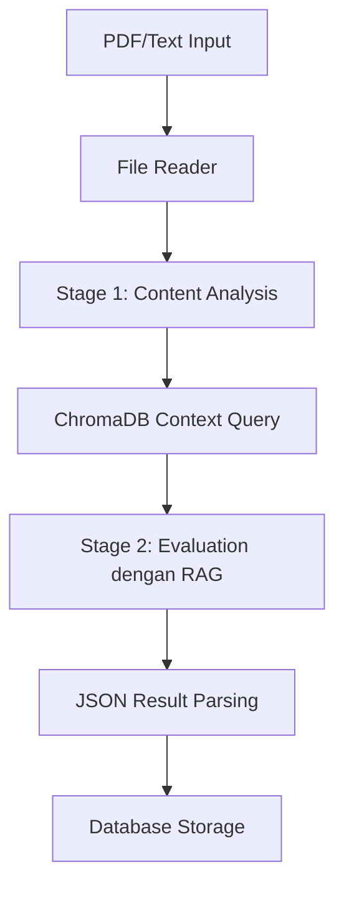

# AI CV Evaluator

Aplikasi untuk mengevaluasi CV menggunakan AI dengan backend Go, PostgreSQL, ChromaDB, dan Google Gemini API.

## Study Case Submission

### 1. Approach & Design

#### Arsitektur dan Pemilihan Teknologi

**Clean Architecture Implementation**
- **Domain Layer**: Entitas bisnis utama (`EvaluationResult`, `Document`)
- **Repository Layer**: Abstraksi untuk operasi database (`EvaluationRepository`)
- **Service Layer**: Logika bisnis utama (`EvaluationService`)
- **Handler Layer**: HTTP handlers dan routing (`EvaluationHandler`)
- **Infrastructure Layer**: Implementasi konkret (PostgreSQL, ChromaDB, Gemini AI)

**Pemilihan Go Fiber Framework**
```
Alasan pemilihan Fiber:
✓ Performance tinggi (Express.js-inspired untuk Go)
✓ Memory efficient dan low latency
✓ Built-in middleware support
✓ Mudah untuk rapid development
✓ Excellent routing dan parameter handling
```

**Asynchronous Processing dengan Goroutines**
```go
// Implementasi async processing
func (s *EvaluationService) EvaluateAsync(cvPath, reportPath string) (string, error) {
    jobID := generateJobID()
    
    // Launch goroutine untuk processing
    go func() {
        ctx := context.Background()
        result, err := s.aiPipeline.ProcessEvaluation(ctx, cvPath, reportPath)
        
        if err != nil {
            log.Printf("AI evaluation failed: %v", err)
            return
        }
        
        // Save hasil ke database
        s.repo.SaveResult(jobID, result)
        log.Printf("AI evaluation completed for job: %s", jobID)
    }()
    
    return jobID, nil
}
```

**Dependency Injection Pattern**
```
main.go
├── Config Loading
├── Database Connection (PostgreSQL)
├── External Services (ChromaDB, Gemini AI)
├── Repository Layer
├── Service Layer (dengan AI Pipeline)
└── Handler Layer + Routing
```

### 2. LLM Integration

#### Desain Prompt Engineering

**Stage 1 Analysis Prompt**
```
Sistem menggunakan structured prompt untuk analisis awal:
- Ekstraksi informasi kunci dari CV
- Identifikasi skill set dan experience level  
- Parsing project complexity dan technical implementation
- Output dalam format semi-structured untuk stage 2
```

**Stage 2 Evaluation Prompt**
```
Evaluation prompt dengan konteks RAG:
- Menggunakan hasil Stage 1 sebagai input
- Menggabungkan konteks dari ChromaDB (evaluation guidelines)
- Structured JSON output dengan scoring rubric
- Feedback generation berdasarkan kriteria yang konsisten
```

#### LLM Chaining Workflow



**Detailed Chain Process:**
1. **Input Processing**: PDF → Text extraction menggunakan file reader utility
2. **Stage 1 Analysis**: Gemini AI menganalisis CV dan project report secara terpisah
3. **Context Retrieval**: Query ChromaDB untuk mendapatkan evaluation guidelines yang relevan
4. **Stage 2 Evaluation**: Combine analysis + context → structured evaluation dengan scoring
5. **Result Processing**: Parse JSON response dan validasi score ranges

#### RAG (Retrieval-Augmented Generation) Implementation

**ChromaDB Integration untuk Context**
```go
// RAG Context Retrieval
func (p *Pipeline) getEvaluationContext(ctx context.Context, content string) ([]string, error) {
    queryText := "CV evaluation guidelines project assessment scoring rubric"
    
    documents, err := p.chromaClient.QueryDocuments(ctx, queryText, 3)
    if err != nil {
        // Fallback ke default guidelines
        return defaultEvaluationGuidelines, nil
    }
    
    // Convert documents ke context strings
    context := make([]string, len(documents))
    for i, doc := range documents {
        context[i] = doc.Content
    }
    
    return context, nil
}
```

**Evaluation Guidelines Storage**
```
ChromaDB menyimpan:
- CV evaluation criteria dan scoring rubric
- Project assessment guidelines  
- Technical skills evaluation matrix
- Red flags dan quality indicators

Benefit RAG:
✓ Konsistensi evaluasi berdasarkan guidelines yang tetap
✓ Contextual evaluation yang tidak bias
✓ Scalable knowledge base untuk berbagai posisi
✓ Easy updates tanpa retrain model
```

### 3. Tantangan & Pembelajaran

#### Tantangan ChromaDB API Versioning

**Masalah yang Dihadapi:**
```bash
Error: "The v1 API is deprecated. Please use /v2 apis"
HTTP 410 pada semua v1 endpoints
```

**Root Cause Analysis:**
- ChromaDB version terbaru (1.0.0) hanya support v2 API
- Dokumentasi online masih banyak yang menggunakan v1
- V2 API menggunakan tenant/database/collection hierarchy

**Solusi yang Diimplementasikan:**
```go
// V2 API Structure Discovery
const (
    tenantID   = "default_tenant"
    databaseID = "default_database"
)

// Correct v2 endpoint format
endpoint := fmt.Sprintf("/api/v2/tenants/%s/databases/%s/collections", 
    tenantID, databaseID)
```

#### Tantangan Gemini API Model Access

**Masalah yang Dihadapi:**
```bash
Error: "models/gemini-1.5-flash is not found"
Error: "User location is not supported for the API use"
```

**Problem Solving Process:**
1. **Model Discovery**: Implement API call untuk list available models
2. **Fallback Strategy**: Multiple model attempts (gemini-pro, gemini-1.5-pro)
3. **Regional Issues**: API key region restrictions handling
4. **Error Handling**: Graceful degradation dengan informative error messages

**Final Implementation:**
```go
func (g *GeminiClient) getAvailableModel(ctx context.Context) (string, error) {
    models := []string{"gemini-1.5-pro", "gemini-pro", "gemini-1.5-flash"}
    
    for _, model := range models {
        if g.testModel(ctx, model) {
            return model, nil
        }
    }
    
    return "", fmt.Errorf("no available Gemini models found")
}
```

#### Tantangan ChromaDB Embeddings Requirement

**Masalah yang Dihadapi:**
```bash
Error: "missing field `embeddings` at line 1 column 1727"
HTTP 422 pada document insertion
```

**Analisis & Solusi:**
- ChromaDB v2 requires explicit embeddings untuk semua documents
- Auto-embedding tidak tersedia by default
- Implemented simple hash-based embedding generation

```go
// Simple embedding generation
func (c *Client) generateSimpleEmbedding(text string) []float64 {
    embedding := make([]float64, 384)
    hash := md5.Sum([]byte(strings.ToLower(text)))
    
    for i := 0; i < len(embedding); i++ {
        byteIndex := i % len(hash)
        embedding[i] = (float64(hash[byteIndex]) - 127.5) / 127.5
    }
    
    // Add text-based features
    textLen := float64(len(text))
    wordCount := float64(len(strings.Fields(text)))
    
    if len(embedding) > 2 {
        embedding[0] = textLen / 1000.0
        embedding[1] = wordCount / 100.0
    }
    
    return embedding
}
```

#### Tantangan Collection UUID Handling

**Masalah yang Dihadapi:**
```bash
Error: "Collection ID is not a valid UUIDv4"
```

**Pembelajaran & Solusi:**
- ChromaDB v2 menggunakan UUID sebagai collection identifier, bukan nama
- Perlu retrieve UUID saat collection creation/access
- Store UUID untuk subsequent operations

#### Key Learnings

1. **API Evolution Awareness**: Selalu check API version compatibility
2. **Graceful Degradation**: System harus tetap berfungsi meski external service gagal
3. **Error Context**: Detailed error messages sangat membantu debugging
4. **Fallback Strategies**: Multiple alternatives untuk critical operations
5. **Documentation Gap**: Official docs tidak selalu up-to-date dengan latest changes

#### Production Considerations

```go
// Robust error handling implementation
if p.chromaClient != nil {
    documents, err := p.chromaClient.QueryDocuments(ctx, queryText, 3)
    if err != nil {
        log.Printf("ChromaDB query failed, continuing without context: %v", err)
        chromaContext = []string{} // Fallback to default guidelines
    }
} else {
    log.Printf("ChromaDB not available, using default evaluation guidelines")
    chromaContext = defaultEvaluationGuidelines
}
```

**System Resilience:**
✓ AI Pipeline bekerja tanpa ChromaDB (fallback ke default guidelines)
✓ Multiple Gemini model fallbacks
✓ Asynchronous processing dengan proper error handling
✓ Database connection pooling untuk high concurrency
✓ Structured logging untuk monitoring dan debugging

---

## Setup Database

### 1. Konfigurasi Environment Variables

Buat file `.env` di root directory dengan mengcopy dari `.env.example`:

```bash
cp .env.example .env
```

Edit file `.env` dengan konfigurasi database Anda:

```env
# Database Configuration
DB_HOST=localhost
DB_PORT=5432
DB_USER=your_username
DB_PASSWORD=your_password
DB_NAME=your_database_name
DB_SSLMODE=disable

# Connection Pool Settings (optional)
DB_MAX_OPEN=25
DB_MAX_IDLE=25
DB_CONNECTION_LIFETIME=5m
DB_CONNECTION_IDLE=5m

# Application Configuration
APP_PORT=8080

# API Keys
GEMINI_API_KEY=your_gemini_api_key

# ChromaDB Configuration
CHROMADB_URL=http://localhost:8000
```

### 2. Setup PostgreSQL Database

Pastikan PostgreSQL sudah terinstall dan running, kemudian buat database:

```sql
CREATE DATABASE your_database_name;
CREATE USER your_username WITH ENCRYPTED PASSWORD 'your_password';
GRANT ALL PRIVILEGES ON DATABASE your_database_name TO your_username;
```

### 3. Migrasi Database

Aplikasi akan otomatis menjalankan migrasi database saat pertama kali dijalankan. File migrasi terletak di `database/migrations/`.

## Menjalankan Aplikasi

### 1. Start Services dengan Docker Compose

```bash
# Start PostgreSQL dan ChromaDB
docker-compose up -d
```

### 2. Seed ChromaDB dengan Data Konteks (Opsional)

```bash
# Build dan jalankan seeder
go build -o seed-chromadb tools/seed-chromadb/main.go
./seed-chromadb
```

### 3. Jalankan Aplikasi

```bash
# Build aplikasi
go build -o server cmd/server/main.go

# Jalankan aplikasi
./server
```

Atau langsung jalankan dengan:

```bash
go run cmd/server/main.go
```

## Fitur AI Pipeline

- **File Reading**: Mendukung parsing PDF dan file teks untuk ekstraksi konten
- **ChromaDB Integration**: Retrieval-Augmented Generation (RAG) untuk konteks evaluasi
- **Gemini AI Integration**: Multi-stage evaluation menggunakan Google Gemini API
- **Asynchronous Processing**: Evaluasi berjalan di background dengan status tracking
- **Structured Output**: Hasil evaluasi dalam format JSON terstruktur

## Fitur Konfigurasi Database

- **Auto Migration**: Aplikasi otomatis menjalankan migrasi database saat startup
- **Connection Pool**: Konfigurasi connection pool untuk performa optimal
- **Environment Variables**: Semua konfigurasi database menggunakan environment variables
- **SSL Support**: Mendukung konfigurasi SSL untuk koneksi database
- **Graceful Connection**: Koneksi database dengan error handling yang baik

## API Endpoints

- `POST /api/v1/evaluate` - Evaluate CV
- `GET /api/v1/result/:id` - Get evaluation result

## Struktur Database

Tabel `evaluations`:
- `id` (SERIAL PRIMARY KEY)
- `content` (TEXT) - Konten CV yang dievaluasi  
- `result` (TEXT) - Hasil evaluasi
- `score` (INTEGER) - Skor evaluasi
- `created_at` (TIMESTAMP)
- `updated_at` (TIMESTAMP)